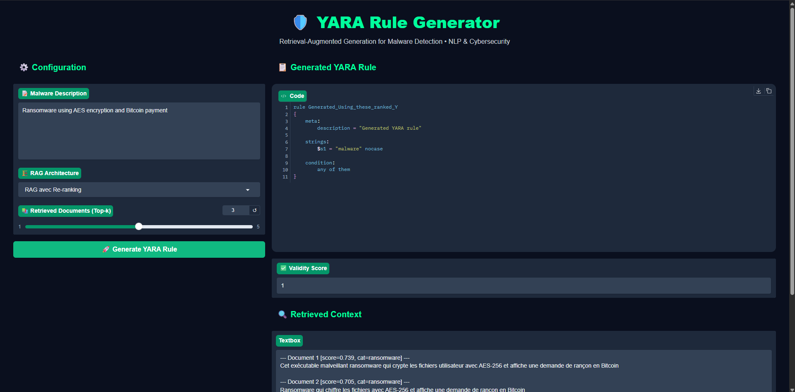

# YARA-RAG-Architectures

## Génération Automatique de Règles YARA avec les Architectures RAG

Ce projet présente une implémentation complète de plusieurs architectures **RAG (Retrieval-Augmented Generation)** appliquées à la génération automatique de règles **YARA** en cybersécurité.

L’objectif est d’évaluer différentes stratégies de retrieval et de génération afin d’améliorer :
- la détection de malware,
- l’analyse de menaces,
- la génération de signatures YARA,
- et la robustesse des systèmes LLM en cybersécurité.

---

# 📌 Contenu du Dépôt

Ce dépôt contient :

- 📓 Un notebook Jupyter complet :
  - `YARA_RAG_Notebook.ipynb`

- 🧠 Plusieurs architectures RAG implémentées en Python :
  - Baseline
  - Classic RAG
  - Re-ranking RAG
  - Hybrid RAG
  - Multi-hop RAG
  - Graph RAG
  - Agentic RAG

- 📊 Une analyse comparative détaillée :
  - `Tableau Comparatif Et Analyse Critique Yara Rag.pdf`

- ⚙️ Les implémentations Python des architectures :
  - dossier `yara_rag_architectures/`

---


# 🚀 RAG Architectures Comparative Dashboard



# 🏗️ Architectures Implémentées

## 1. Baseline — LLM sans RAG

Génération directe de règles YARA sans récupération de contexte.

### Caractéristiques
- Aucun retrieval
- Prompting direct
- Pipeline simple
- Temps d’exécution rapide

---

## 2. Classic RAG

Architecture standard Retrieval-Augmented Generation.

### Caractéristiques
- Retrieval dense
- Injection de contexte
- Génération enrichie

---

## 3. Re-ranking RAG

Architecture avec re-classement des documents récupérés.

### Caractéristiques
- Similarité cosinus
- Sélection optimisée des documents
- Meilleur contexte pour le LLM

---

## 4. Hybrid RAG

Combinaison retrieval dense + sparse (TF-IDF).

### Caractéristiques
- TF-IDF
- Embeddings
- Reciprocal Rank Fusion (RRF)
- Très adapté aux règles YARA

---

## 5. Multi-hop RAG

Retrieval itératif avec reformulation automatique.

### Caractéristiques
- Multi-step retrieval
- Expansion progressive du contexte
- Raisonnement multi-étapes

---

## 6. Graph RAG

Retrieval basé sur un graphe de connaissances.

### Caractéristiques
- Navigation dans un graphe
- Relations entre documents
- Expansion par voisinage

---

## 7. Agentic RAG

Agent intelligent choisissant dynamiquement la meilleure stratégie.

### Caractéristiques
- Routage adaptatif
- Choix dynamique d’architecture
- Robustesse améliorée

---

# 📂 Structure du Projet

```bash
YARA-RAG-Architectures/
│
├── yara_rag_architectures/
│   ├── 01_baseline.py
│   ├── 02_classic_rag.py
│   ├── 03_rerank_rag.py
│   ├── 04_hybrid_rag.py
│   ├── 05_multi_hop_rag.py
│   ├── 06_graph_rag.py
│   └── 07_agentic_rag.py
│
├── YARA_RAG_Notebook.ipynb
├── Tableau Comparatif Et Analyse Critique Yara Rag.pdf
├── README.md
├── requirements.txt
└── LICENSE
```

---

# ⚙️ Installation

## 1. Cloner le dépôt

```bash
git clone https://github.com/AchrafElboumashouli/Impl-mentation-et-comparaison-des-architectures-RAG.git
cd YARA-RAG-Architectures
```

---

## 2. Installer les dépendances

```bash
pip install -r requirements.txt
```

---

# 📦 Dépendances Recommandées

Créer un fichier `requirements.txt` contenant :

```txt
numpy
scikit-learn
networkx
sentence-transformers
faiss-cpu
transformers
torch
jupyter
pandas
```

---

# 🚀 Exécution

## Exécuter le notebook

```bash
jupyter notebook
```

Puis ouvrir :

```bash
YARA_RAG_Notebook.ipynb
```

---

## Exécuter une architecture spécifique

### Classic RAG

```bash
python yara_rag_architectures/02_classic_rag.py
```

### Hybrid RAG

```bash
python yara_rag_architectures/04_hybrid_rag.py
```

### Agentic RAG

```bash
python yara_rag_architectures/07_agentic_rag.py
```

---

# 🧪 Exemple de Requête

```python
query = "Ransomware encryptant les fichiers avec AES"
```

---

# 📝 Réponses aux Questions

## Question 1 : Quelle architecture est la plus performante ?

Le **RAG avec Re-ranking** et l’**Agentic RAG** se montrent les plus performants en termes de validité structurelle des règles YARA générées.

Le re-ranking permet de sélectionner les documents les plus pertinents parmi un ensemble élargi, ce qui améliore la qualité du contexte fourni au LLM.

L’Agentic RAG, en choisissant dynamiquement la meilleure stratégie, obtient des résultats comparables avec une meilleure robustesse selon la nature de la requête.

---

## Question 2 : Quelle architecture est la plus robuste ?

L’**Agentic RAG** est la plus robuste car elle adapte sa stratégie à la complexité de la requête.

- Requête simple → RAG classique
- Requête complexe → Multi-hop RAG

Cette adaptabilité lui permet de maintenir une performance acceptable même sur des requêtes ambiguës ou atypiques.

---

## Question 3 : Quelle architecture est la plus adaptée au problème YARA ?

Le **RAG Hybride (TF-IDF + Embeddings)** est particulièrement bien adapté aux règles YARA car celles-ci contiennent :

- des noms d’API,
- des opcodes,
- des chaînes techniques,
- des signatures très spécifiques.

La recherche sparse (TF-IDF) capture les correspondances exactes tandis que les embeddings capturent les similarités sémantiques.

La combinaison des deux approches améliore fortement le retrieval.

---

## Question 4 : Quelle architecture produit le plus d’hallucinations ?

Le **Baseline (LLM sans RAG)** produit le plus d’hallucinations.

Sans contexte récupéré, le modèle peut générer :
- des strings inventées,
- des fonctions inexistantes,
- des conditions incorrectes.

Le **Multi-hop RAG** peut également produire des hallucinations lorsque la reformulation de requête dérive trop du problème initial.

---

# 📊 Analyse Comparative

Le fichier :

```bash
Tableau Comparatif Et Analyse Critique Yara Rag.pdf
```

contient :
- une analyse détaillée,
- une comparaison des performances,
- les avantages/inconvénients,
- l’évaluation qualitative des architectures.

---

# 🔬 Concepts Utilisés

- Retrieval-Augmented Generation (RAG)
- Cybersécurité
- Analyse de malware
- YARA Rules
- Dense Retrieval
- Sparse Retrieval
- Hybrid Search
- Multi-hop Retrieval
- Graph Retrieval
- Agentic AI
- Threat Intelligence

---

# 🚀 Améliorations Futures

- Intégration FAISS / ChromaDB
- Dataset réel de malware
- Intégration OpenAI / Llama
- Évaluation automatique des règles YARA
- Interface Streamlit
- Support LangChain / LlamaIndex
- Vector Database hybride

---

# 👨‍💻 Auteur

ACHRAF EL BOUMASHOULI

Projet Académique — Cybersécurité & Intelligence Artificielle

---

# 📄 Licence

MIT License
```
